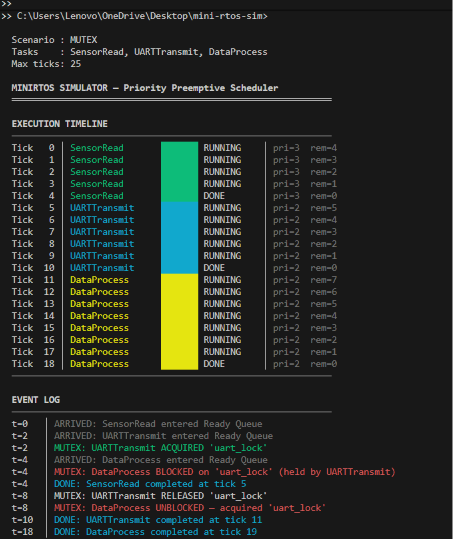

# MiniRTOS Simulator

> A Python simulation of a **Priority Preemptive RTOS Scheduler** — the same scheduling algorithm used by ARM Mbed OS, FreeRTOS, and Zephyr RTOS. Demonstrates task scheduling, mutex contention, preemption, and deadlock detection with a live Gantt-chart terminal output.

---

## What Is an RTOS Scheduler?

An RTOS (Real-Time Operating System) manages multiple tasks running on a single CPU. It decides:
- **Who runs now?** (the highest-priority ready task)
- **What if a more important task becomes ready?** (preempt the current task immediately)
- **What if a task needs a shared resource?** (block it on a mutex, run something else)
- **What if two tasks are each waiting for something the other holds?** (deadlock — detect and report)

This simulator implements exactly this logic, tick by tick, with a visual output.

---

## Quick Start

```bash
pip install -r requirements.txt

# Run the default scenario (mutex contention)
python minirtos.py

# Run the basic preemption demo
python minirtos.py --scenario basic

# Run the deadlock demonstration
python minirtos.py --scenario deadlock

# Run tests
pytest tests/ -v
```

---

## Sample Output



---

## Scenarios

### `basic` — Pure Priority Preemption
Three tasks (SensorRead, DataProcess, DisplayUpdate) with no mutexes. The highest-priority task always runs. Demonstrates preemption when a high-priority task arrives while a lower-priority task is executing.

### `mutex` — Mutex Contention *(default)*
Two tasks compete for a shared `uart_lock` mutex (simulating two tasks needing to use the same UART peripheral). One task blocks when it cannot acquire the lock. Shows: blocking, unblocking, and priority-ordered mutex handoff.

### `deadlock` — Deadlock Detection
Two tasks each acquire one mutex then attempt to acquire the other — creating a circular wait. The simulator detects this and halts with a clear diagnostic. Demonstrates the "deadly embrace" problem and why global mutex ordering is required in real RTOS design.

---

## Architecture

```
mini-rtos-sim/
├── minirtos.py     ← CLI entry point + scenario definitions
├── scheduler.py    ← Core scheduling logic (tick-by-tick execution)
├── task.py         ← Task class with state machine (READY/RUNNING/BLOCKED/DONE)
├── mutex.py        ← Mutex with priority-ordered unblocking
├── renderer.py     ← Gantt-chart terminal renderer + statistics table
├── tests/
│   ├── test_task.py    ← Task state machine tests
│   └── test_mutex.py   ← Mutex acquire/release/priority tests
├── requirements.txt
└── README.md
```

---

## Key Design Decisions

**Why Python instead of C?**
The goal is to demonstrate scheduling *concepts* clearly. Python's readability makes the algorithm transparent. A production RTOS scheduler (like Mbed OS or FreeRTOS) is written in C for performance, but the logic is identical to what this simulator implements.

**Why tick-based simulation instead of real time?**
RTOS schedulers use a hardware timer interrupt (the "tick") as their time base. Simulating at the tick level mirrors exactly how a real scheduler makes decisions — one decision per timer interrupt.

**Why priority-ordered mutex release?**
In a real RTOS, releasing a mutex should wake up the highest-priority blocked task first — otherwise a high-priority task could be left blocked while a lower-priority one runs (a form of priority inversion). This simulator implements the correct priority-ordered handoff.

**Why separate `task.py`, `mutex.py`, `scheduler.py`, `renderer.py`?**
Single Responsibility Principle. The scheduler doesn't know how to render output. The renderer doesn't know how scheduling decisions are made. Each module is independently testable.

---

## Concepts Demonstrated

| Concept | Where |
|:---|:---|
| Priority Preemption | `scheduler.py` — `_highest_priority_ready_task()` |
| Task State Machine | `task.py` — `mark_running()`, `mark_blocked()`, `mark_done()` |
| Mutex (binary lock) | `mutex.py` — `try_acquire()`, `release()` |
| Priority Inversion prevention | `mutex.py` — `release()` sorts waiters by priority |
| Deadlock Detection | `scheduler.py` — `_detect_deadlock()` |
| Gantt Chart Visualisation | `renderer.py` — `_render_timeline()` |

---

## Running Tests

```bash
pytest tests/ -v
```

```
tests/test_task.py::TestTaskInitialState::test_initial_state_is_ready      PASSED
tests/test_task.py::TestTaskStateTransitions::test_mark_running_sets_state  PASSED
tests/test_mutex.py::TestMutexAcquire::test_free_mutex_acquired_successfully PASSED
tests/test_mutex.py::TestMutexRelease::test_release_grants_highest_priority  PASSED
...
16 passed in 0.05s
```

---

## Tech Stack

| Component | Technology |
|:---|:---|
| Language | Python 3.10+ |
| CLI | `argparse` (stdlib) |
| Data modelling | `dataclasses`, `enum` (stdlib) |
| Terminal output | ANSI colour codes (auto-detected) |
| Testing | `pytest` |
| No external runtime dependencies | All stdlib except pytest |
